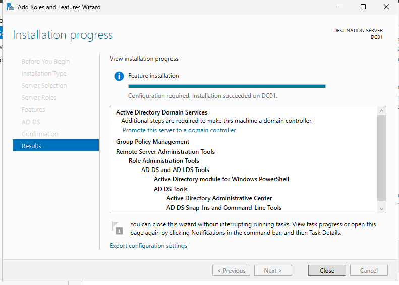
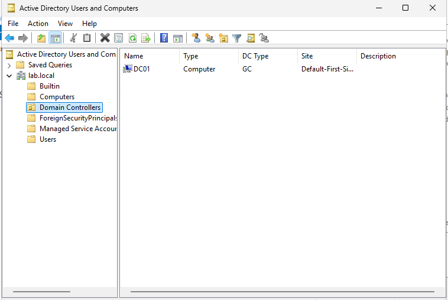
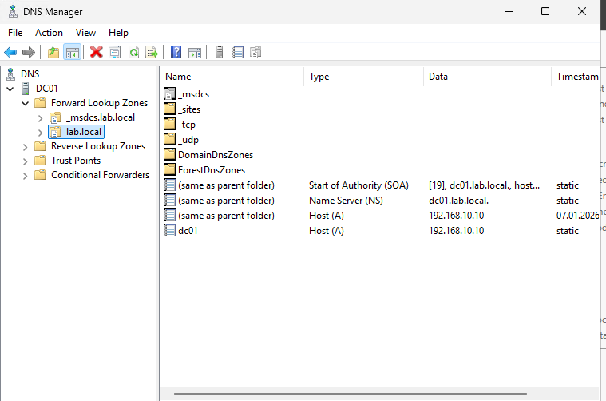
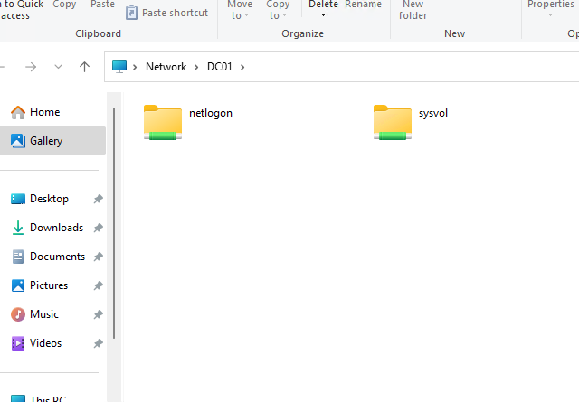
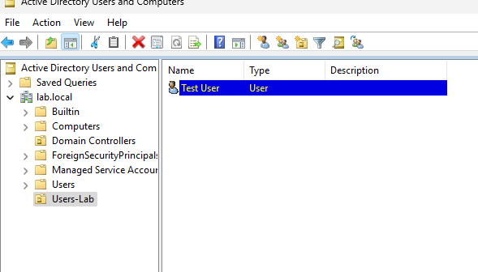
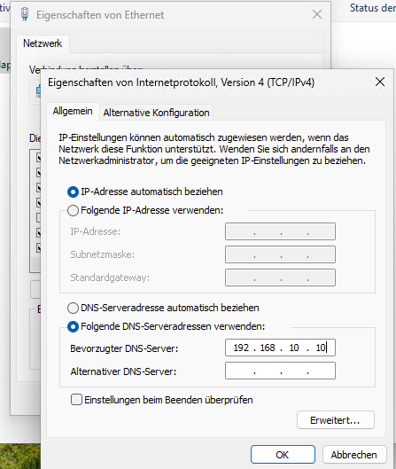
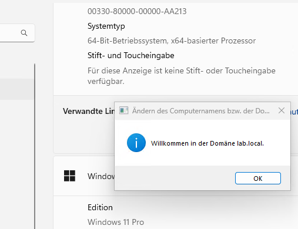
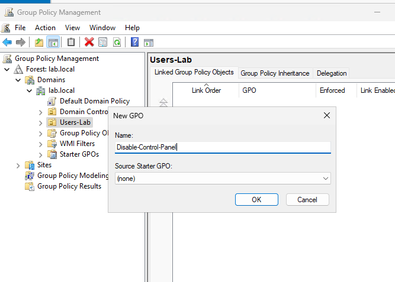
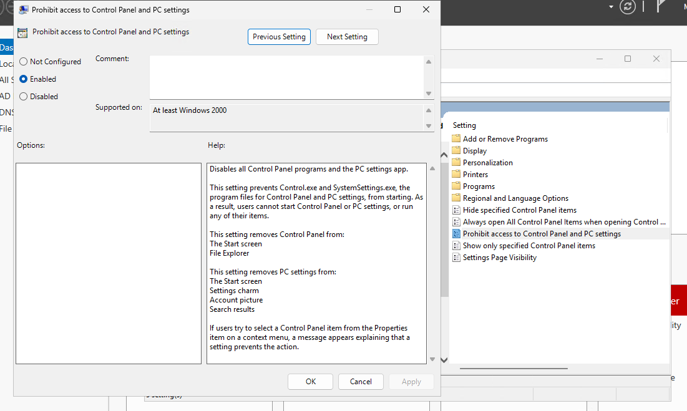
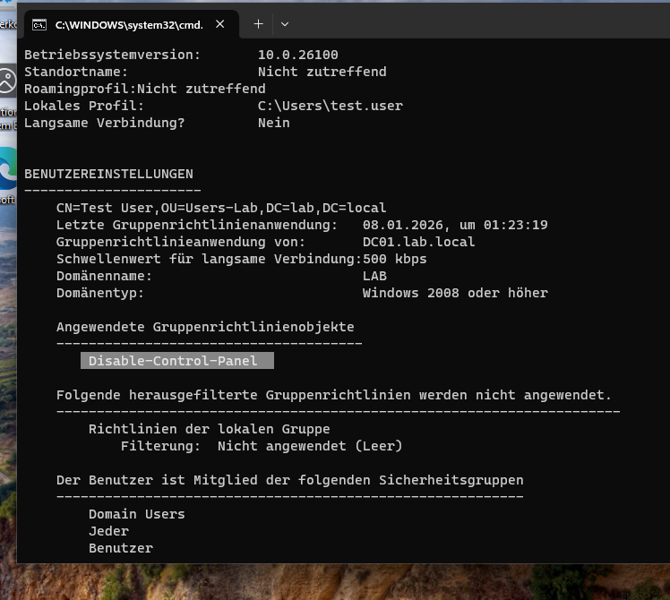

# Windows Server 2025 - Active Directory Domain Services Lab  

This lab demonstrates the installation, configuration, and verification of Active Directory Domain Services (AD DS) using Windows Server 2025.  
The foucus is on core domain functionaltiy, user management, and Group Policy

## Lab Environment
- Hyper-V virtual machines
- Windows Server 2025 (Domain Controller)
- Windows 11 (Domain Client)
- Private virtual network

## Basic Server Configuration
- The server was renamed to "DC01"  
- A static IP address was configured on the server 
  - IP Adress: 192.168.10.10
  - Subnet Mask: 255.255.255.0
  - DNS Server: 192.168.10.10
    
  

## Installing Active Directory Domain Services
The Active Directory Domain Services role was installed using Server Manager without pronoting the server initially 

## Domian Controller Promotion
The server was promoted to a Domain Controller by creating a new forest with the domain name:
- Domian name: lab.local
- DNS Server: Installed automatically during promotion
The server was restarted after the promotion process

## Verification
The Active Directory installation was verified by checking:
- Active Directory User and Computers (ADUC) 
- DNS Forward Lookup Zones 
- SYSVOL and NETLOGON shared folders 
The presence of SYSVOL and NETLOGON confirmed that Group Policy and domain logon functionality were working correctly

## User and OU Management
An Organizational Unit (OU) named "Users-Lab" was created to organize domain users  
A test domain user was created inside the OU:
- Username: test.user

## Domain Join
A Windows 11 Client was configured to use the Domain Controller as its DNS server and was successfully joined to the domain "lab.local"  
The domain user was able to log in successfully on the client system

## Group Policy
A user-based Group Policy Object (GPO) named "Disable-Control-Panel" was created and linked to the "Users-Lab" OU  
The Policy was configured to restrict access to the Control Panel for domain users

## GPO Verification
The successful application of the Group Policy was verified on the domain-joined client using the "gpresult" command

## Conclusion
This lab demonstrates a complete and functional Active Directory setup. including domain creation, client integration, user mangement and Group Policy enforcemnt  
The enviroment reflects a realistic enterprise-style configuration using best practices
