# Windows Server 2025 -AD, DNS, DHCP Failover & WDS  

This lab is a continuation of the basic Active Directory lab.  
It builds upon the existing domain infrastructure by adding high availability networking services and automated deployment  

Previos lab:  
- Windows Server 2025 - Active Directory Basics

## Goal
The goal of this lab is to extend an existing Active Directory enviroment with enterprise-level services such as DHCP Failover and Windows Deployment  Services (WDS)  

## Envuronment
- Existing AD Domain: lab.local
- DC01: Primary Domain Controller, DNs, DHCP, WDS
- DC02: Additional Domain Controller, DNS, DHCP Failover partner
- Hyper-V virtualized environment
- Windows 10 PXE Client

## Implemented Components  
### Active Directory Exension
- Added a second domain controller (DC02)
- Verified AD replication between DC01 and DC02
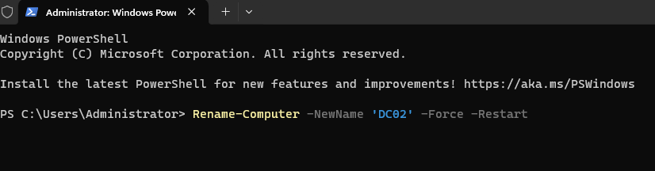
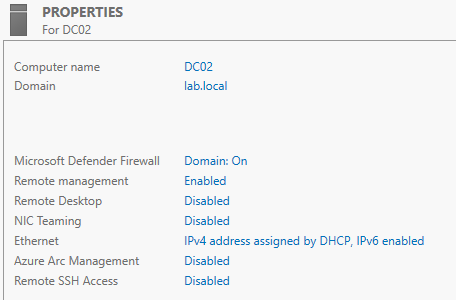
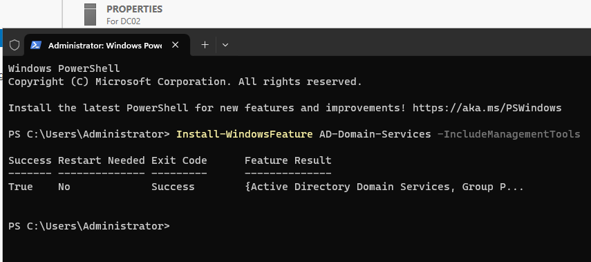
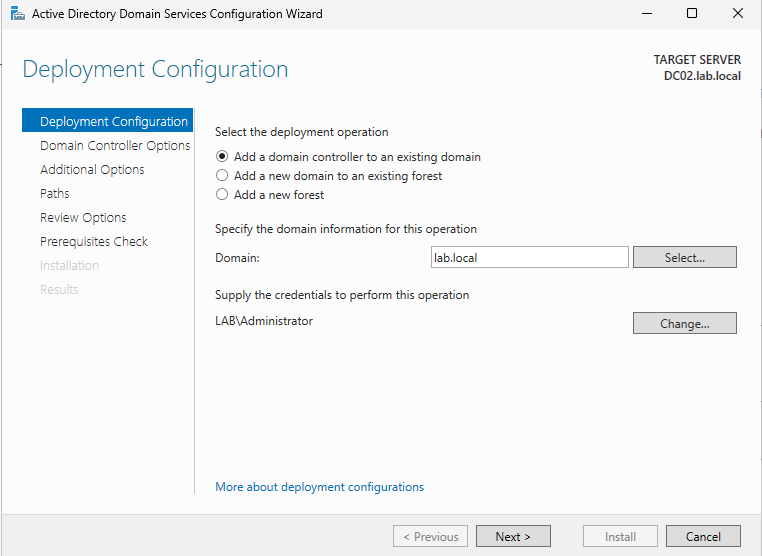

### DNS
- Active Directory-integrated DNS
- Verified forward and reverse name resolution
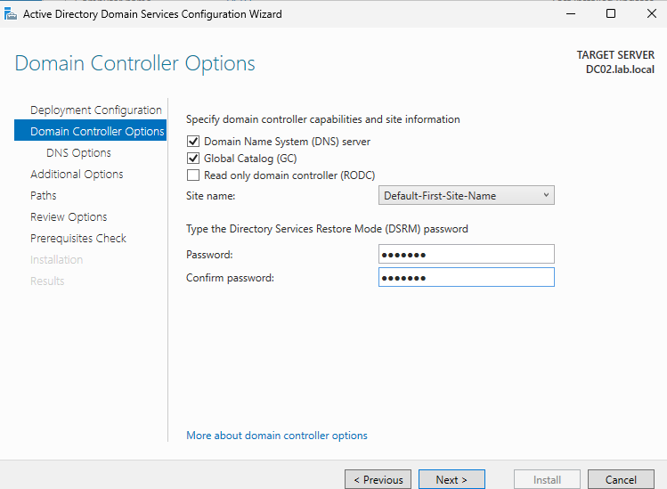
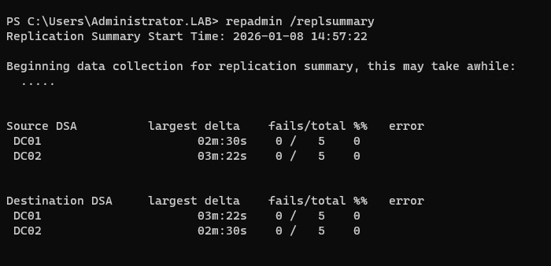

### DHCP with Failover
- Configured IPv4 scope (192.168.10.0/24)
- Implemented DHCP Failover between DC01 and DC02
- Tested lease replication and failover behavior
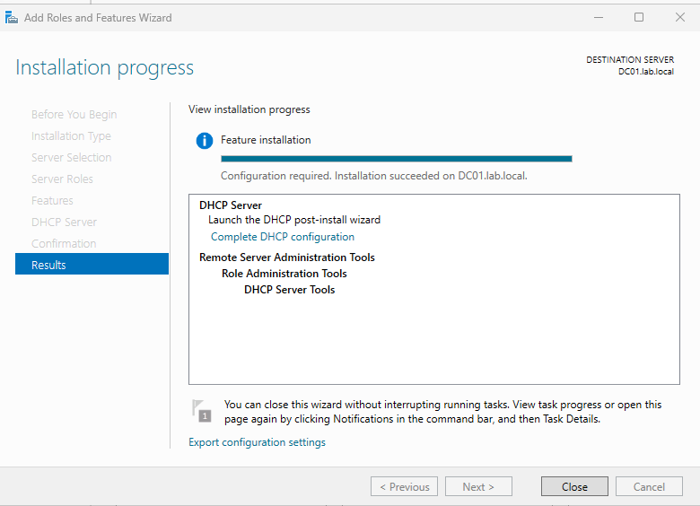
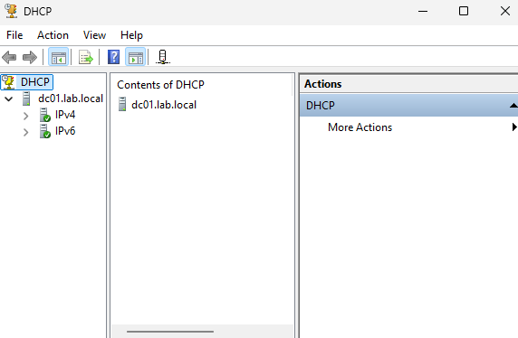
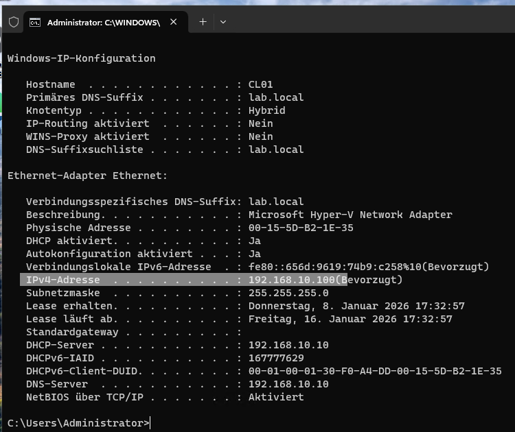
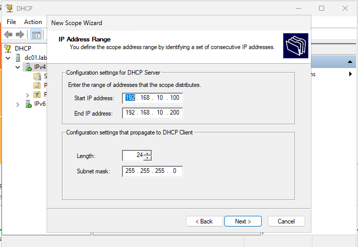
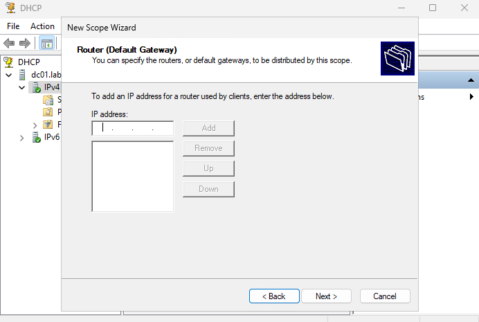
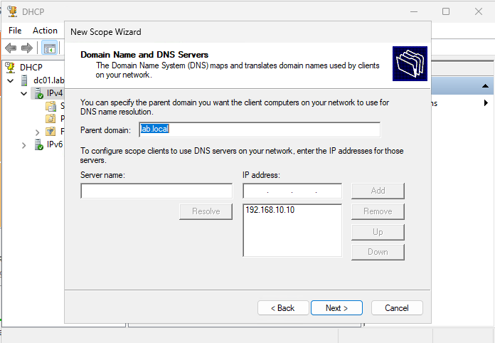
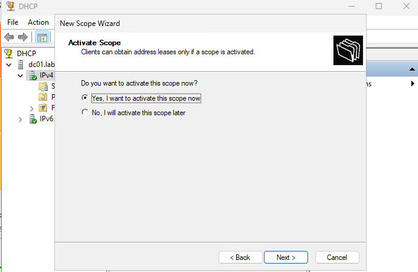
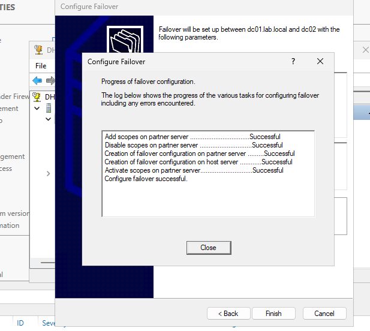
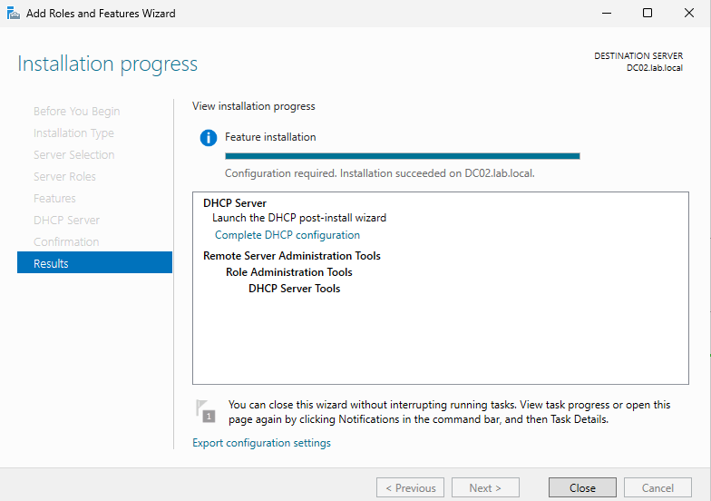

### Windows Deployment Services (WDS)
- Installed WDS in AD-integrated mode
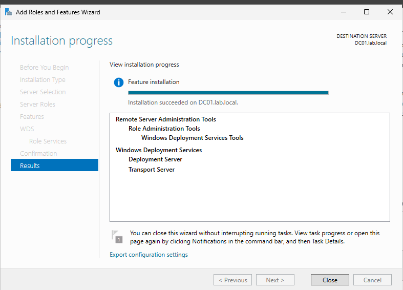
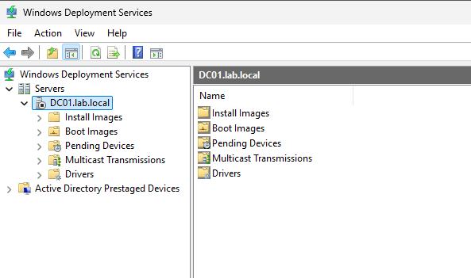

- Added Windows PE boot image
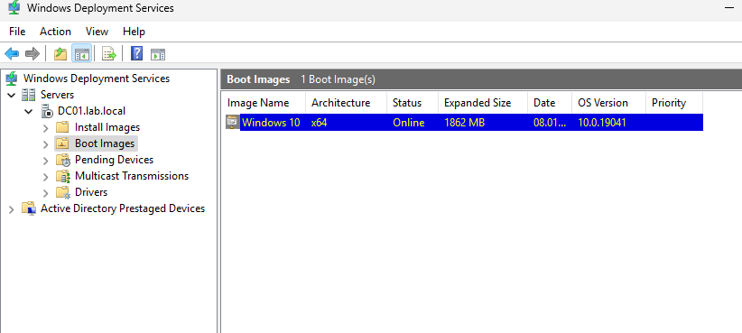

- Added Windows install image
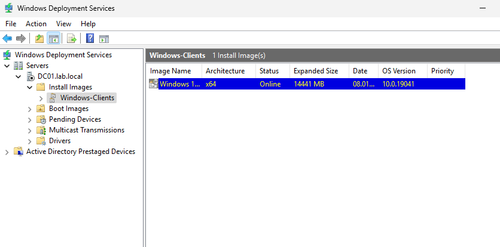

- Configured PXE response settings
### PXE Boot Verification
- Successfully booted a Hyper-v client via PXE
- Client loaded Windows PE and reached Windows Setup
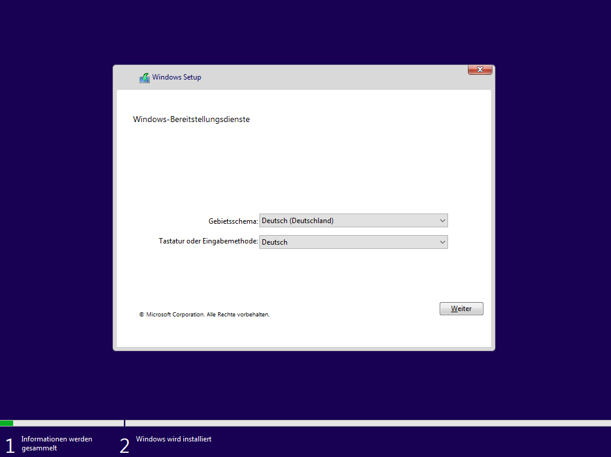

## Result  
This lab demonstrates a scalable and highly available Windows Server infrastructure built on top of an existing Active Directory domain.
